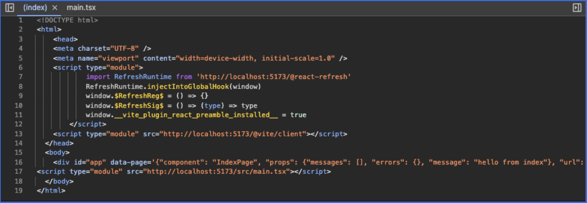

# Reactjs Hot Reload Support with Inertia.js FastAPI Adapter

This is a simple example of how to use the Inertia.js FastAPI Adapter with Reactjs and hot reload support.

## Steps to setup the reactjs example
- Scaffold a new react project. Example is using the [vite + react](https://vitejs.dev/guide/#scaffolding-your-first-vite-project) setup
- Setup inertia in your react project
- Setup a fastapi project using fastapi-inertia
- If you use `react + vite` for developement, you need to add the script tag below at the top of your template before the `inertia_head` tag as shown in [hot_reload/templates/index.html](./templates/index.html).

```html
    <script type="module">
      import RefreshRuntime from "{{ inertia.dev_url }}/@react-refresh"
      RefreshRuntime.injectIntoGlobalHook(window)
      window.$RefreshReg$ = () => {}
      window.$RefreshSig$ = () => (type) => type
      window.__vite_plugin_react_preamble_installed__ = true
    </script>
```
- You get access to the `InertiaContext` object via the `inertia` variable in your template. To pass extra context to the template, you can use the `extra_template_context` option in `InertiaConfig`.
- Run the fastapi project and then run the react project.

Inspecting the head tag of your source file on the browser should return a similar html code snippet to the one below:



**Note**: To setup the fastapi project using `fastapi-inertia` for **react**, you can checkout the backend example under vue here: [examples/vue/classic/backend/main.py](../../vue/classic/backend/main.py)